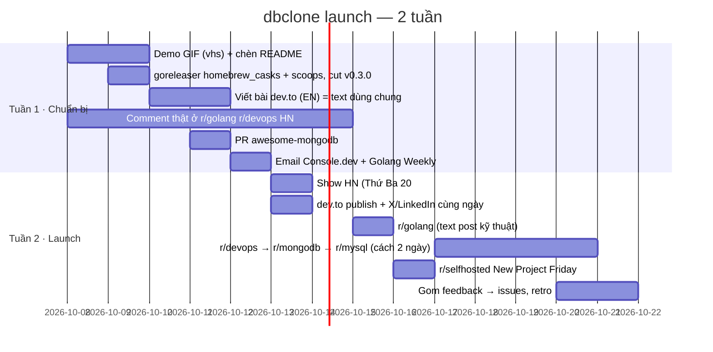

# dbclone — nền tảng launch & marketing (research có trích dẫn)

**Ngày:** 2026-10-07
**Repo:** https://github.com/phuthuycoding/dbclone (tạo 2026-10-02, v0.2.0, 2 sao, MIT, Go CLI)
**Site:** https://phuthuycoding.github.io/dbclone/
**Câu hỏi:** Nên launch dbclone ở đâu, theo thứ tự nào, với rule hiện hành (2025–2026) của từng nền tảng?
**Phương pháp:** 4 worker `znf:researcher` fan-out (HN/PH/Lobsters · Reddit/dev.to · kênh phân phối · prior art) + 1 worker verify re-fetch toàn bộ 27 URL (20 verbatim, 6 paraphrase đúng nghĩa, 1 mismatch đã sửa, 0 dead link). Raw: `docs/reference/2026-10-07-launch-platforms-raw/` (worker-1..4, verify).
**Độ tin cậy:** Mỗi mục ghi rõ **Verified** (fetch trực tiếp trang gốc) hay **Unverified** (chỉ có snippet search / nguồn thứ cấp). Reddit login-wall cả curl lẫn Playwright nên toàn bộ rule subreddit là Unverified — anh mở bằng browser đã login kiểm tra 1 phút trước khi post.

---

## 0. Hiện trạng repo & việc phải làm TRƯỚC khi launch

Kiểm tra trực tiếp trong repo (`README.md`, `.goreleaser.yaml`, `gh repo view`):

- **Chưa có demo GIF/asciinema.** README chỉ có mock ASCII (grep `gif|asciinema|<img` trả về 0 dòng ngoài badge). Với CLI có live progress bar, GIF là thứ quyết định 5 giây đầu trên HN/Reddit/X. Làm bằng `vhs` (charmbracelet) hoặc `asciinema` + `agg`.
- **goreleaser chưa publish Homebrew tap / Scoop / Docker.** `.goreleaser.yaml` chỉ có `builds`/`archives`/`checksum`/`changelog`. Thiếu `homebrew_casks` và `scoops` → người đọc HN trên macOS phải `go install` hoặc tải tar.gz, ma sát cao.
- **Repo 5 ngày tuổi.** Nhiều kênh có gate tuổi: homebrew-core (30 ngày), r/selfhosted (3 tháng), awesome-go (5 tháng). Lịch bên dưới xếp theo gate này.
- **Đã có:** og.png + sitemap + robots (site), 20 topics GitHub, badge pkg.go.dev (đã index), CI + release workflow, LICENSE MIT, `-check` onboarding.

---

## 1. Xếp hạng nền tảng (impact / effort cho solo-dev OSS CLI)

### 1.1 Hacker News — Show HN · **Impact cao nhất · Effort thấp · Verified**

**Rule (https://news.ycombinator.com/showhn.html, https://news.ycombinator.com/newsguidelines.html):**
- "Show HN is for something you've made that other people can play with" → CLI chạy được là hợp lệ; landing page / blog post đơn thuần là off-topic.
- "The project must be something you've worked on personally and which you're around to discuss" → phải trực chiến trả lời comment ngày launch.
- "Please make it easy for users to try your thing out, ideally without barriers such as signups or emails" → link thẳng repo, install 1 lệnh.
- "Don't solicit upvotes, comments, or submissions" → KHÔNG nhờ bạn bè/team upvote (HN phát hiện voting ring và chôn post).
- "Please don't post generated text or AI-edited text" → title, text, reply phải tự viết tay (rule mới, liên quan AI 2025–2026).
- "Please don't use HN primarily for promotion" → account nên có lịch sử comment không-quảng-cáo trước.
- Tháng 3/2026 mod HN có thảo luận siết Show HN vì "AI slop" (nguồn thứ cấp keydiscussions.com, Unverified) — chưa có rule chính thức, nhưng nên post sớm trước khi có.

**Prior art (hn.algolia.com, Verified qua API):**
- Replibyte: "Show HN: A tool to seed your dev database with real data" → 129 điểm / 78 comment (2022-04-26). Title nói **job-to-be-done**, không nói tên sản phẩm. Resubmit 2.5 tháng sau (không Show HN) → 222 điểm.
- Neosync: Show HN lần 1 "Open-Source Data Replication and Anonymization" (2023-12-08) → **4 điểm / 1 comment** (verify sửa từ 24 → 4). Relaunch "Show HN: Neosync – Open-Source Data Anonymization for Postgres and MySQL" → 246 điểm. **Title nêu tên DB cụ thể + Open-Source thắng lớn.**
- lazydocker: 340 điểm ngày launch, resubmit 3 lần nữa (259, 481, 74) → resubmit khi có release lớn là hợp lệ và hiệu quả.
- pgsync: 166 điểm với title mô tả thuần "PgSync: Sync Postgres data between databases".
- dbmate Show HN 2015: 3 điểm; resubmit 2024: 79 điểm. Snaplet (có funding): Show HN 13 điểm / 4 comment (2023-10-07) rồi đóng cửa 2024-07 → funding/PH không cứu được launch HN yếu.
- Paper arXiv 2511.04453 (138 launch AI repo 2024–2025): trung bình +121 sao/24h, +189/48h, +289/tuần sau khi lên HN.

**Áp dụng cho dbclone:**
- Title đề xuất (theo công thức Neosync + Replibyte): `Show HN: Dbclone – Clone MongoDB/MySQL from prod/staging to local with only Docker installed`. Nêu DB cụ thể, nêu pain (prod → local), nêu điểm khác biệt (không cài tool trên host).
- Text post 5–8 dòng tự viết: tại sao làm (team zenify cần clone 3csoft staging về local hàng ngày), cách chạy (dump pipe thẳng restore trong container, pool stream), thứ nó KHÔNG phải (không phải backup tool, MySQL không consistent snapshot xuyên bảng) — HN thưởng cho sự thẳng thắn.
- Giờ post: KHÔNG có hướng dẫn chính thức. Snippet thứ cấp nói Tue–Thu 6–9 AM PT (Unverified) = **20:00–23:00 giờ VN thứ Ba–Năm**. Hợp lý vì anh ngồi trả lời comment buổi tối VN = sáng US.
- Link = repo GitHub (không phải site GitHub Pages), vì rule "play with".

### 1.2 Reddit · **Impact cao · Effort trung bình · Rule subreddit Unverified**

**Rule chung (redship.io 2026, nguồn thứ cấp trích reddiquette):** "if more than about 10% of your activity is submitting your own stuff, you're probably a spammer" và "it's fine to be a redditor with a website, it's not fine to be a website with a Reddit account" → cần 1–2 tuần comment thật trước khi post.

**Từng subreddit (tất cả Unverified — reddit.com chặn login-wall):**
- **r/golang** — **Verified 2026-10-07** (trang `/r/golang/about/rules` xem được không cần login qua Chrome): rule 9 "Must be Go Related" liệt kê rõ "Announcements & articles about open source Go libraries or applications" và "Dev tools (open source or not) specifically targeted at Go developers" → dbclone (OSS, viết bằng Go) hợp lệ. Rule 4 "Be respectful": "Do not include \"engagement hooks\", like exhortations to subscribe to some channel or redundantly asking what others think" → không kết bài bằng câu hỏi mồi. Rule 6: "Do not post \"Ask an AI\"". Rule 3: đọc FAQ trước. Không thấy rule riêng về self-promo tần suất. Post dạng text kỹ thuật: cách dùng `errgroup`/pool weighted, pipe `exec.Cmd` stdout→stdin qua Docker, retry/backoff — dân r/golang thích kiến trúc hơn marketing.
- **r/selfhosted** — **Verified 2026-10-07** (rules page xem được qua Chrome). Rule 6: "Only in the current \"New Project Megathread\", you may post projects that are younger than 3 months (measured by first public presence, e.g. git commit…)". Rule 2: "Promoted apps must be production ready and have docs", theo Reddit self-promotion guideline. Rule 5: thứ Tư được post "dashboards or tools that help self-hosters" kể cả không self-hosted, phải flair đúng. Rule 4: blog link phải kèm giải thích. Repo tạo 2026-10-02 → post riêng sớm nhất **2027-01-02**; trước đó chỉ megathread.
- **r/devops** — **Verified 2026-10-07**. Rule 4: "Self promotion goes in the weekly self promotion thread"; "Any personal affiliation with a product or tool must be fully disclosed at the top"; "posts should be as self-contained as possible and not link to external blogs". Rule 5: "If your post or comment reads like it was primarily generated by LLMs there is a high chance it will be removed". Rule 1: không chỉ link, phải có thảo luận. → **KHÔNG post riêng**; comment trong weekly self-promotion thread, tự viết, khai báo "I'm the author" ở đầu.
- **r/mysql** — **Verified 2026-10-07**. Rule 2: "No Self Promotion — Please follow the guidelines set in Reddit's Self Promotion Policy". Rule 6: phải liên quan MySQL. → **Bỏ khỏi lịch launch**; chỉ nhắc dbclone khi trả lời câu hỏi có liên quan thật.
- **r/commandline** — **Verified 2026-10-07**. Rule 5: "No new projects newer than 30 days" → sớm nhất **2026-11-02**. Rule 4 "AI Code Policy": "Post text or titles generated with AI are strictly prohibited"; nếu phần đáng kể code là AI-generated, post phải ghi "This software's code is partially AI-generated". Rule 8: phải liệt kê phần mềm tương tự và khác biệt (mongodump/mysqldump thủ công, pgsync/replibyte cho Postgres, Neosync). Rule 3: ≤ 3 post/ngày.
- **r/mongodb** — vẫn login-wall (Unverified). Kiểm tra sau khi login Reddit.
- **r/opensource** — chưa xem.

### 1.3 dev.to (+ bài blog gốc) · **Impact trung bình, lâu dài (SEO/AI search) · Effort trung bình · Verified**

**Rule (https://dev.to/terms):** "not designed primarily for the purposes of promotion or creating backlinks"; "Posts must contain substantial content — they may not merely reference an external link that contains the full post" → phải là bài full: pain → kiến trúc → demo → giới hạn.
**Prior art:** Replibyte launch post dev.to mở bằng pain-point ("creating a fake dataset for running tests is tedious…"). Bài này chính là text dùng lại cho Show HN, Reddit, LinkedIn.
**Hashnode:** rule không fetch được (support page 404) → Unverified, cross-post phụ.

### 1.4 Kênh phân phối = marketing · **Impact trung bình, bền · Effort thấp (config) · Verified**

- **Homebrew tap riêng (ngay):** goreleaser `homebrew_casks` (https://goreleaser.com/customization/homebrew_casks/; `brews` cũ đã deprecated) publish vào repo `phuthuycoding/homebrew-tap` → `brew install phuthuycoding/tap/dbclone`. Không có gate.
- **homebrew-core (sau):** https://docs.brew.sh/Package-Acceptance-Policy: "at least 30 forks, 30 watchers or 75 stars", **"at least 90 forks, 90 watchers or 225 stars for a self-submission by the repository owner"**, "A code repository less than 30 days old is normally not eligible" → mục tiêu 225 sao hoặc nhờ người khác submit khi đủ 75.
- **Scoop (Windows):** goreleaser `scoops:` vào bucket riêng (https://goreleaser.com/customization/scoop/), không gate.
- **Docker image:** goreleaser `dockers_v2` (`dockers` deprecated từ v2.12), cần bước `docker login` trong CI. **Ưu tiên thấp** — dbclone tự điều khiển Docker daemon, chạy trong container cần mount socket, trải nghiệm không tự nhiên.
- **pkg.go.dev:** đã index (badge). Index trigger qua proxy.golang.org khi có người `go install` tag mới.
- **awesome-go** (https://github.com/avelino/awesome-go/blob/main/CONTRIBUTING.md): "have at least 5 months of history since the first commit" → sớm nhất **2027-03-02**; "coverage should be >= 80% for non-data-related packages and >=90% for data-related packages" nếu testable (dbclone hiện có `main_test.go` nhỏ — cần đầu tư test). 1 item/PR, kèm link repo + pkg.go.dev.
- **awesome-mongodb** (ramnes, CONTRIBUTING fetch OK): không gate sao/tuổi; format `[Name](link) - description`, alphabetical, 1 PR/item → **làm ngay tuần 1**, mục Tools hoặc Backup/Migration.
- **awesome-mysql** (shlomi-noach, CONTRIBUTING fetch OK): "Must be free and open source"; phải "reasonably recognized and adopted", "Code must not be abandoned/discontinued"; script mới chưa test bị từ chối → **đợi có traction** (sau HN).

### 1.5 Newsletter / curated · **Impact trung bình · Effort rất thấp (1 email) · Một phần Verified**

- **Console.dev** (https://console.dev/selection-criteria, Verified): gửi email hello@console.dev; tiêu chí: developer là user chính, maintain tích cực, docs tốt. Phù hợp.
- **Golang Weekly:** homepage không có mục submit; trang contact Cooperpress chỉ có editor@cooperpress.com ("If you have any questions or suggestions, the ideal way … is by emailing us") → gửi email ngắn + link GIF.
- **Changelog News:** `/submit` 404 → không tìm được quy trình. **TLDR:** không tìm được. Bỏ qua.

### 1.6 Product Hunt · **Impact thấp cho OSS CLI · Effort trung bình · Verified**

**Rule:** https://www.producthunt.com/launch — "12:01 am Pacific Time is the best time to launch" (= **14:01 giờ VN**); "Company accounts are prohibited" → account cá nhân. Community guidelines: cấm "asking for upvotes … incentivizing upvotes", vi phạm bị gỡ launch. Không có ngày tốt chính thức (Tue/Wed chỉ là snippet thứ cấp).
**Nhận định:** PH thiên SaaS/consumer; Snaplet (sản phẩm cùng mảng, có funding) không lên nổi ở HN và PH không cứu được. Chỉ làm **sau** HN nếu rảnh, kỳ vọng thấp, mục đích chính là backlink + badge.

### 1.7 Lobsters · **Impact trung bình (đúng gu kỹ thuật) · Bị chặn bởi account · Verified**

https://lobste.rs/about: invite-only; "self-promo should be less than a quarter of one's stories and comments"; account mới (70 ngày đầu) không được gửi invite, không được submit domain site chưa từng thấy, không được flag (verify xác nhận); việc tag `show` bị khóa cho account mới KHÔNG được xác nhận trên trang. Tag `show` = "Show Lobsters / Projects", có tag `go`, `databases`, `release`. → Cần xin invite ngay (hỏi trong HN thread / Gophers); vì github.com là domain đã thấy, có thể post repo sớm hơn 70 ngày, nhưng giữ dưới 25% self-promo.

### 1.8 X / LinkedIn / Discord-Slack (Gophers, MongoDB community) · **Không có nguồn — Unverified**

Worker không tìm được nguồn tin cậy. Khuyến nghị chung: post GIF + 1 câu pain + link, cùng ngày Show HN; LinkedIn hợp với tệp devops VN. Gophers Slack có channel `#showandtell` theo thói quen cộng đồng (chưa verify policy).

---

## 2. Lịch launch 2 tuần (giờ VN)

**Mốc sau 2 tuần (gate tuổi/sao):**
- ~2026-11-01 (repo ≥ 30 ngày): đủ điều kiện tuổi homebrew-core, còn cần 225 sao (hoặc 75 sao + người khác submit).
- Sau 70 ngày có account Lobsters: post tag `show` + `go` + `databases`.
- 2027-01-02: r/selfhosted standalone post.
- 2027-03-02: awesome-go PR (cần coverage ≥ 90% vì data-related).
- Khi có driver PostgreSQL (README mục "Adding an engine" đã chừa chỗ): resubmit Show HN theo mẫu Neosync/lazydocker — đây là cú đẩy thứ hai lớn nhất, Postgres mở rộng tệp người dùng gấp nhiều lần.

---

## 3. Không tìm được / cần anh tự kiểm tra

- Rule text chính thức r/golang, r/selfhosted, r/devops, r/mongodb, r/mysql, r/commandline (login-wall) — mở `reddit.com/r//about/rules` bằng browser đã login.
- Giờ post Show HN chính thức (HN không công bố).
- Changelog News / TLDR submit process.
- Policy self-promo của Gophers Slack, MongoDB Discord.
- Tactic X/LinkedIn cho solo OSS có nguồn.
