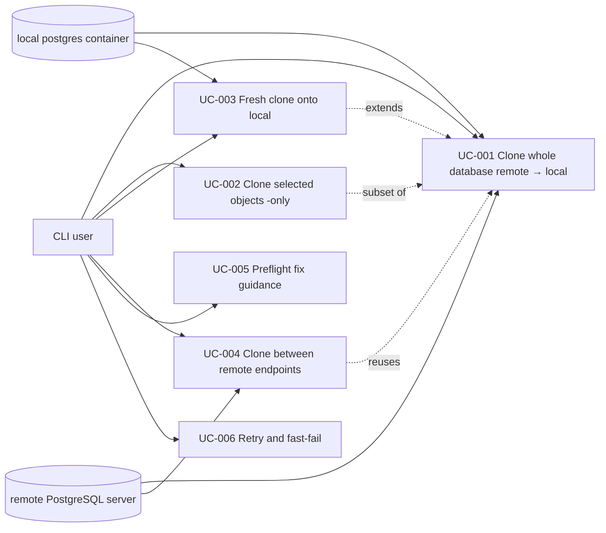

# Use Case Diagram

- Actors: CLI user; local `postgres` container (tools host); remote PostgreSQL server (profile endpoint)
- Use cases: whole-db clone, subset clone, fresh clone, remote↔remote clone, preflight guidance, retry/fast-fail
- Relationships: UC-003 and UC-002 specialize UC-001 (fresh drop / object subset); UC-004 reuses the UC-001 stream with remote connections on both sides; UC-005 and UC-006 are cross-cutting behaviors of every clone
